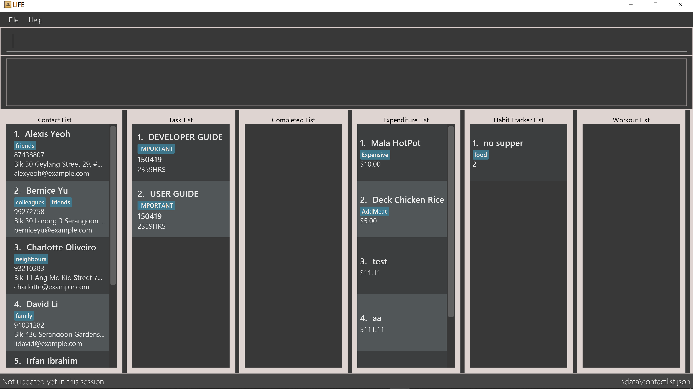

:site-section: AboutUs
:imagesDir: ../images
:stylesDir: ../stylesheets

= [white big]#*Wong Yu Qi* - Project Portfolio for _LIFE_#

== Overview

This Project Portfolio documents my role and contributions to the project _LIFE_.

== About the project

My team and I are a group of 4 Year 2 students in university. For one of our Software Engineering modules (CS2113T), we were tasked with
enhancing a basic address book application. Our enhancement was a morph from a given address book into a self-improvement lifestyle management application
called _LIFE_ (Lifestyle Improvement For Everyone) that uses the Command Line Interface (CFI). +

This enhanced application helps our target audience, students, to improve their quality of life. This is done so
by providing a platform to help students manage 4 main aspects of their lives. LIFE enables students to keep track of their
tasks, keep a simple account of their expenditure, keep track of their habits and keep a log of their workouts.

== My role

My main task was to implement the Habit Tracker feature. +
I was also in-charge of the respective sections for the User Guide and Developer Guide with the aim
of ensuring that they are reader friendly and effective in providing

In the non-technical aspect, I took charge of the language and flow of our documentations.
The following sections illustrate these enhancements and documentations in detail, other additional enhancements that I have made as well as the relevant sections that I have added to the user and developer guide in relation to these enhancements.

Note the following symbols used in this document:

TIP: A grey highlight (called a mark-up) e.g. `HABIT` indicates that it is a Class
or a command word eg. `addHabit` that can be inputted into the command line
and executed by the application.

== Summary of contributions

This section shows a summary of my coding, documentation and other helpful contributions
that i have contributed to the team project.

To aid the potential visualization of my work, here is the user interface of _LIFE_.

.User Interface of _LIFE_

* *Major Feature #1*: implemented the `Habit` feature.
** +What does it do:+
*** Allows an individual to keep track of his progress in cultivating a desired habit through adding a habit
along with its progress.
*** Help provide a visual representation of his progress as the user keys in the number of consecutive days he
has successfully completed a habit.
** +Justification+
*** More often than not, people tend to give themselves more credit than they actually did. Hence, with this habit tracker,
one's progress would be quantified. With this visual representation of his progress, it would allow him to have a better gauge,
and provide an encouragement to persevere on.

* Documentation
** Refining and ensuring sufficient content of the developer and user guides.

== Contributions to the User Guide
|===
|_Given below are sections that I contributed to the User Guide. They showcase
my ability to write documentation and target end users._
|===

//include::../UserGuide.adoc[tag=UserGuideIntro]
include::../UserGuide.adoc[tag=HabitFeature]

== Contributions to the Developer Guide
|===
|_Given below are sections I contributed to the Developer Guide.
They showcase my ability to write technical documentation and the
technical depth of my contributions to the project._
|===

include::../DeveloperGuide.adoc[tag=Introduction]
include::../DeveloperGuide.adoc[tag=developerModel]
include::../DeveloperGuide.adoc[tag=HabitFeature]

